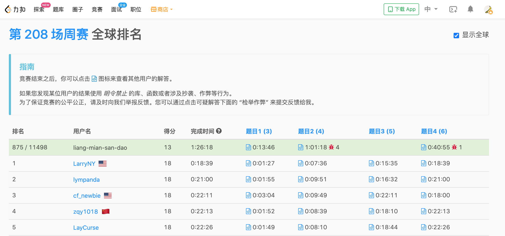

[toc]
### 算法
leetcode 2道easy，6道medium，1道hard
[105 从前序与中序遍历序列构造二叉树 中等](https://leetcode-cn.com/problems/construct-binary-tree-from-preorder-and-inorder-traversal/)
[106. 从中序与后序遍历序列构造二叉树 中等](https://leetcode-cn.com/problems/construct-binary-tree-from-inorder-and-postorder-traversal/)
[235. 二叉搜索树的最近公共祖先	简单](https://leetcode-cn.com/problems/lowest-common-ancestor-of-a-binary-search-tree/)
[5523. 文件夹操作日志搜集器	简单](https://leetcode-cn.com/problems/crawler-log-folder/)
[5526. 最多可达成的换楼请求数目	困难](https://leetcode-cn.com/problems/maximum-number-of-achievable-transfer-requests/)
[5524. 经营摩天轮的最大利润	中等](https://leetcode-cn.com/problems/maximum-profit-of-operating-a-centennial-wheel/)
[5525. 皇位继承顺序	中等](https://leetcode-cn.com/problems/throne-inheritance/)
[366. 寻找二叉树的叶子节点	中等](https://leetcode-cn.com/problems/find-leaves-of-binary-tree/)
[298. 二叉树最长连续序列	中等](https://leetcode-cn.com/problems/binary-tree-longest-consecutive-sequence/)
周赛#208，差点AK

### Java
nope
### 网课
nope
